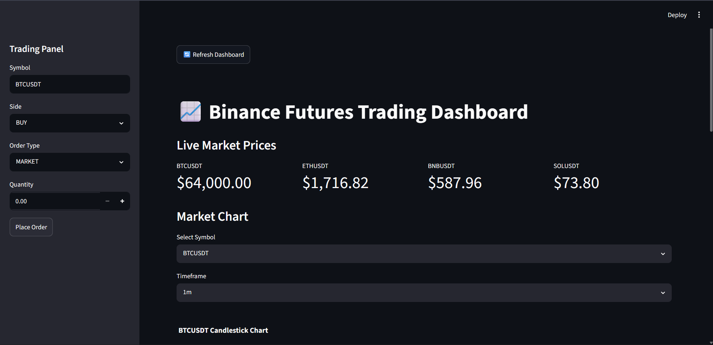
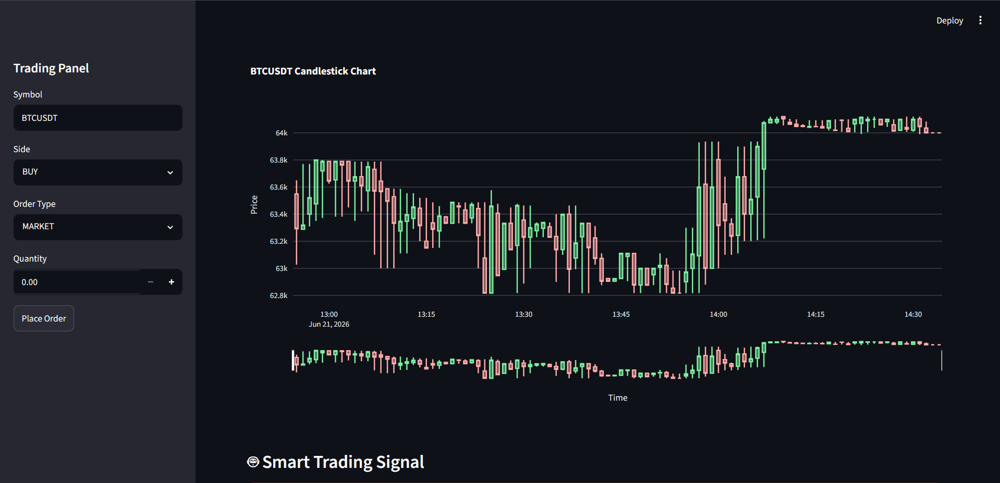
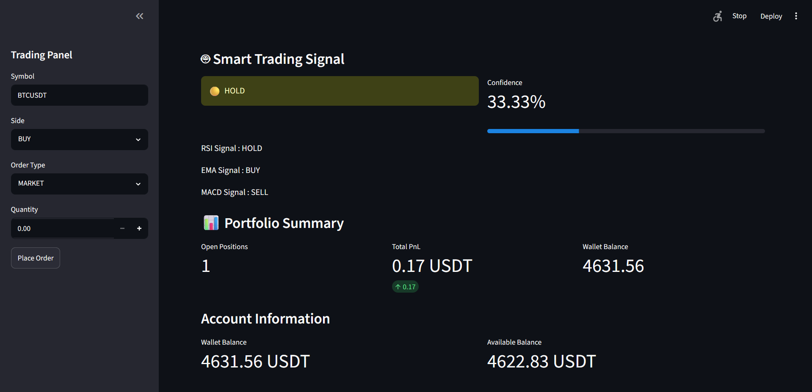
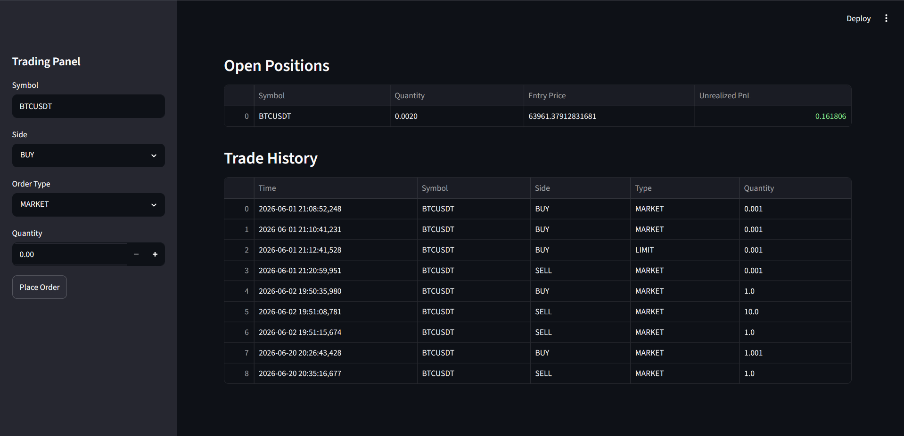

# AI-Powered Binance Futures Trading Dashboard

## Project Documentation

### Author

Vedant Jagtap

### Project Type

Cryptocurrency Trading Analytics Dashboard

### Version

v1.0

### Status

Completed (Portfolio Version)

---

# Table of Contents

1. Project Overview
2. Problem Statement
3. Project Objectives
4. System Architecture
5. Technology Stack
6. Project Features
7. Dashboard Walkthrough
8. Technical Indicators
9. Smart Signal Engine
10. Portfolio Management
11. Backtesting Engine
12. Performance Metrics
13. Project Structure
14. Challenges Faced
15. Learnings
16. Future Scope
17. Screenshots
18. Conclusion

---

# 1. Project Overview

The AI-Powered Binance Futures Trading Dashboard is a real-time cryptocurrency trading analytics platform developed using Python, Streamlit, Binance Futures API, Pandas, Plotly, and technical analysis libraries.

The dashboard allows users to monitor live cryptocurrency market prices, visualize candlestick charts, generate trading signals, manage portfolio information, track open positions, review trading history, and evaluate trading strategies through backtesting.

The purpose of this project was to understand how modern trading platforms operate, how technical indicators are calculated, how market data flows through a system, and how trading decisions can be generated using algorithmic rules.

This project serves as both a learning platform and a portfolio project demonstrating API integration, data processing, dashboard development, technical analysis, and quantitative trading concepts.

---

# 2. Problem Statement

Most beginner traders struggle with:

* Understanding market trends.
* Reading candlestick charts.
* Interpreting technical indicators.
* Combining multiple indicators into a trading decision.
* Evaluating strategy performance before risking capital.

Professional trading platforms often provide these capabilities but are expensive, complex, or difficult for beginners to understand.

This project was built to provide a simplified and educational trading dashboard that combines market data, technical indicators, trading signals, and performance analytics in one place.

---

# 3. Project Objectives

The main objectives of this project were:

### Market Monitoring

* Display live Binance Futures prices.
* Support multiple cryptocurrency trading pairs.
* Visualize price movement through candlestick charts.

### Technical Analysis

* Implement RSI indicator.
* Implement EMA crossover strategy.
* Implement MACD indicator.
* Generate actionable trading signals.

### Trading Analytics

* Track account balances.
* Display open positions.
* Monitor unrealized profit and loss.
* Maintain trade history.

### Strategy Evaluation

* Test strategies on historical market data.
* Measure profitability.
* Calculate risk metrics.
* Evaluate trading performance.

---

# 4. System Architecture

Insert Architecture Diagram Here


### Architecture Flow

User
↓
Streamlit Dashboard
↓
Binance Futures API
↓
Market Data Processing
↓
Technical Analysis Engine
↓
Smart Signal Engine
↓
Portfolio Management
↓
Backtesting Engine
↓
Performance Analytics

---

# 5. Technology Stack

### Programming Language

* Python

### Frontend

* Streamlit

### Data Processing

* Pandas
* NumPy

### Visualization

* Plotly

### Market Data Source

* Binance Futures API

### Technical Analysis

* TA Library
* RSI
* EMA
* MACD

### Version Control

* Git
* GitHub

---

# 6. Project Features

## Live Market Prices

The dashboard retrieves real-time cryptocurrency prices directly from Binance Futures.

Supported symbols include:

* BTCUSDT
* ETHUSDT
* BNBUSDT
* SOLUSDT

Features:

* Live price updates
* Multiple asset monitoring
* Real-time market visibility

---

## Interactive Candlestick Charts

The dashboard provides dynamic candlestick chart visualization.

Capabilities:

* Multiple timeframe selection
* Symbol switching
* Market trend visualization
* Historical candle analysis

---

## Technical Analysis

The dashboard calculates technical indicators directly from market data.

Indicators include:

### RSI

Relative Strength Index

Purpose:

* Detect overbought conditions.
* Detect oversold conditions.
* Identify potential reversals.

### EMA

Exponential Moving Average

Purpose:

* Identify trend direction.
* Detect bullish crossovers.
* Detect bearish crossovers.

### MACD

Moving Average Convergence Divergence

Purpose:

* Measure trend momentum.
* Detect momentum shifts.
* Confirm trend strength.

---

# 7. Dashboard Walkthrough

## Screenshot 1 – Main Dashboard

Insert Screenshot Here



Description:

The main dashboard acts as the control center of the application.

Displayed information:

* Live cryptocurrency prices
* Order placement panel
* Market symbol selection
* Timeframe selection
* Navigation to analysis modules

This section provides an overview of market conditions before any trading decision is made.

---

## Screenshot 2 – Market Analysis & Candlestick Charts

Insert Screenshot Here



Description:

This section visualizes price action using candlestick charts.

Features:

* Real-time market visualization
* Symbol selection
* Timeframe switching
* Trend analysis

Candlestick charts are the foundation of technical analysis and are used to calculate all indicators within the system.

---

## Screenshot 3 – Smart Trading Signal Engine

Insert Screenshot Here



Description:

The Smart Signal Engine combines multiple technical indicators to generate a final trading recommendation.

Possible outputs:

* BUY
* SELL
* HOLD

The system also generates a confidence score based on indicator agreement.

Example:

RSI = HOLD

EMA = BUY

MACD = SELL

Final Signal = HOLD

Confidence = 33.33%

This prevents reliance on a single indicator and encourages confirmation-based trading.

---

## Screenshot 4 – Portfolio & Trade Management

Insert Screenshot Here



Description:

This section provides visibility into account performance.

Displayed information:

### Open Positions

Shows:

* Symbol
* Position Quantity
* Entry Price
* Unrealized Profit/Loss

### Trade History

Tracks:

* Time
* Symbol
* Order Type
* Buy/Sell Side
* Quantity

### Account Information

Displays:

* Wallet Balance
* Available Balance
* Current Profit/Loss

---

# 8. Smart Signal Engine

The Smart Signal Engine is the core decision-making component of the system.

It combines:

* RSI Signal
* EMA Signal
* MACD Signal

Each indicator contributes one vote.

Example:

RSI = BUY

EMA = BUY

MACD = SELL

BUY Votes = 2

SELL Votes = 1

Final Signal = BUY

Confidence = 66.67%

This voting mechanism reduces dependence on any single indicator.

---

# 9. Backtesting Engine

The project includes a strategy backtesting system for evaluating performance using historical data.

Features:

* Historical candle analysis
* Strategy simulation
* Position management
* Trade outcome tracking

Backtesting allows traders to evaluate strategies before using them in live markets.

---

# 10. Performance Metrics

The system calculates several performance metrics.

### Profit / Loss

Total strategy profitability.

### Win Rate

Percentage of profitable trades.

### Profit Factor

Ratio of gross profit to gross loss.

### Max Drawdown

Largest decline from peak balance.

### Sharpe Ratio

Risk-adjusted return metric.

These metrics help determine whether a strategy is robust or unreliable.

---

# 11. Project Structure

```text
trading_bot/
│
├── dashboard.py
├── market_data.py
├── charts.py
├── signals.py
├── ema_strategy.py
├── macd_strategy.py
├── smart_signal.py
├── backtest.py
├── strategy_backtest.py
├── account.py
├── positions.py
├── orders.py
├── trade_history.py
├── client.py
├── validators.py
│
├── tests/
│
├── screenshots/
│
├── README.md
├── PROJECT_DOCUMENTATION.md
└── requirements.txt
```

# 12. Challenges Faced

During development several challenges were encountered:

* Binance API integration issues
* Symbol-based signal generation bugs
* DataFrame column mismatches
* Technical indicator calculation errors
* Dashboard synchronization issues
* Backtesting logic corrections
* Streamlit UI adjustments

Each issue required debugging, testing, and code refactoring.

---

# 13. Key Learnings

Through this project I gained practical experience in:

* API integration
* Financial market data processing
* Technical analysis
* Quantitative trading concepts
* Streamlit dashboard development
* Backtesting methodology
* Performance evaluation
* Software debugging
* Git and GitHub workflows

---

# 14. Future Scope

Potential future enhancements include:

* Machine Learning-based predictions
* LSTM price forecasting
* Sentiment analysis integration
* News-based trading signals
* Risk management automation
* Portfolio optimization
* Multi-asset strategy support
* Cloud deployment
* Real-time alerts

---

# 15. Conclusion

The AI-Powered Binance Futures Trading Dashboard successfully combines market data, technical analysis, signal generation, portfolio monitoring, and backtesting into a unified platform.

The project demonstrates practical skills in Python development, API integration, financial analytics, dashboard engineering, and algorithmic trading concepts.

Beyond serving as a trading analytics platform, the project provided valuable hands-on experience in building end-to-end data-driven applications and strengthened understanding of quantitative trading systems.

# Disclaimer

This project was developed for educational, learning, and portfolio purposes to demonstrate the implementation of a cryptocurrency trading dashboard using Python, Streamlit, the Binance Futures API, technical indicators, and quantitative strategy backtesting.

The trading signals generated by this application are based on predefined technical analysis indicators such as RSI (Relative Strength Index), EMA (Exponential Moving Average), and MACD (Moving Average Convergence Divergence). These signals are not financial advice and should not be considered recommendations to buy, sell, or hold any financial asset.

The backtesting results presented in this project are based on historical market data and simplified trading assumptions. Past performance does not guarantee future results. Real-world trading involves additional factors such as market volatility, slippage, liquidity constraints, exchange fees, execution delays, leverage risk, and changing market conditions that are not fully captured in this implementation.

This project should not be used for live trading or investment decisions without extensive validation, risk management, and professional financial analysis. The author assumes no responsibility for any financial losses resulting from the use of this software.

The primary objective of this project is to showcase software engineering, data analysis, API integration, technical indicator implementation, dashboard development, and strategy evaluation skills within a simulated trading environment.


Version 1.0 represents a stable portfolio-ready implementation suitable for demonstrating software engineering, data analysis, and financial technology development skills.
